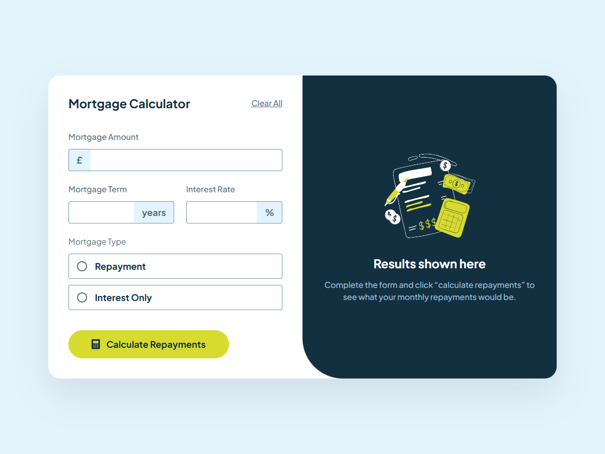

# Frontend Mentor - Mortgage repayment calculator

This is a solution to the [Mortgage repayment calculator](https://www.frontendmentor.io/challenges/mortgage-repayment-calculator-Galx1LXK73). Frontend Mentor challenges help you improve your coding skills by building realistic projects.

## Table of contents

- [Overview](#overview)
  - [The challenge](#the-challenge)
  - [Screenshot](#screenshot)
  - [Links](#links)
- [My process](#my-process)
  - [Built with](#built-with)
  - [What I learned](#what-i-learned)
- [Author](#author)

## Overview

### The challenge

Your users should be able to:

- Input mortgage information and see monthly repayment and total repayment amounts after submitting the form
- See form validation messages if any field is incomplete
- Complete the form only using their keyboard
- View the optimal layout for the interface depending on their device's screen size
- See hover and focus states for all interactive elements on the page

### Screenshot

### Links

- Solution URL: https://github.com/JairRaid/mortgage-repayment-calculator
- Live Site URL:

## My process

### Built with

- Semantic HTML5 markup
- React
- Tailwind
- Flexbox
- CSS Grid
- Mobile-first workflow

### What I learned

I learned to:

- Write `Integration` and `Unit Tests` code using [Vitest](https://vitest.dev/), [React Testing Library](https://testing-library.com/docs/react-testing-library/intro/), [@testing-library/user-event](https://testing-library.com/docs/user-event/intro/)

## Author

- Email: rakotonirainyriija@gmail.com
- Facebook: https://web.facebook.com/jair.rakoto.3/
